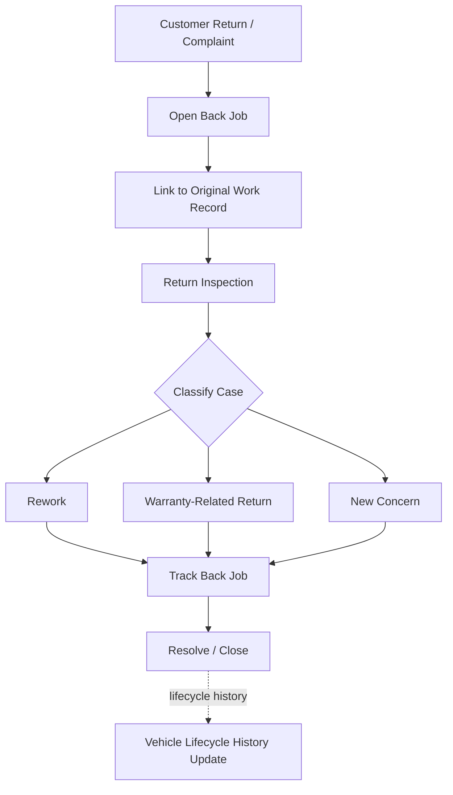

# Back Job Flow

```mermaid
flowchart TD
  Return[Customer Return / Complaint] --> Open[Open Back Job]
  Open --> Link[Link to Original Work Record]
  Link --> Inspect[Return Inspection]
  Inspect --> Classify{Classify Case}

  Classify --> Rework[Rework]
  Classify --> Warranty[Warranty-Related Return]
  Classify --> Concern[New Concern]

  Rework --> Track[Track Back Job]
  Warranty --> Track
  Concern --> Track

  Track --> Resolve[Resolve / Close]
  Resolve -. lifecycle history .-> History[Vehicle Lifecycle History Update]
```
