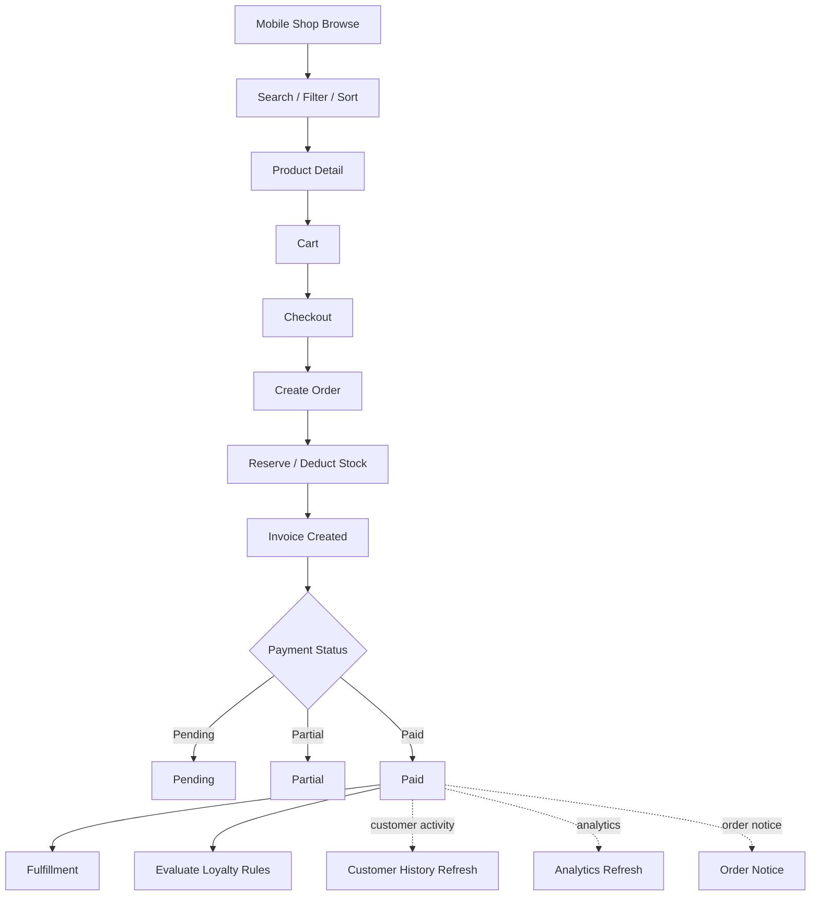

# E-Commerce Flow

```mermaid
flowchart TD
  Browse[Mobile Shop Browse] --> Search[Search / Filter / Sort]
  Search --> Detail[Product Detail]
  Detail --> Cart[Cart]
  Cart --> Checkout[Checkout]
  Checkout --> Order[Create Order]
  Order --> Stock[Reserve / Deduct Stock]
  Stock --> Invoice[Invoice Created]
  Invoice --> Status{Payment Status}

  Status -->|Pending| Pending[Pending]
  Status -->|Partial| Partial[Partial]
  Status -->|Paid| Paid[Paid]

  Paid --> Fulfillment[Fulfillment]
  Paid --> Loyalty[Evaluate Loyalty Rules]

  Paid -. customer activity .-> History[Customer History Refresh]
  Paid -. analytics .-> Analytics[Analytics Refresh]
  Paid -. order notice .-> Notice[Order Notice]
```
