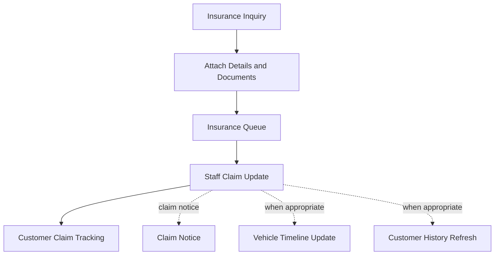

# Insurance Inquiry and Claim Tracking Flow

```mermaid
flowchart TD
  Inquiry[Insurance Inquiry] --> Attach[Attach Details and Documents]
  Attach --> Queue[Insurance Queue]
  Queue --> Review[Staff Claim Update]
  Review --> Tracking[Customer Claim Tracking]

  Review -. claim notice .-> Notice[Claim Notice]
  Review -. when appropriate .-> Timeline[Vehicle Timeline Update]
  Review -. when appropriate .-> History[Customer History Refresh]
```
