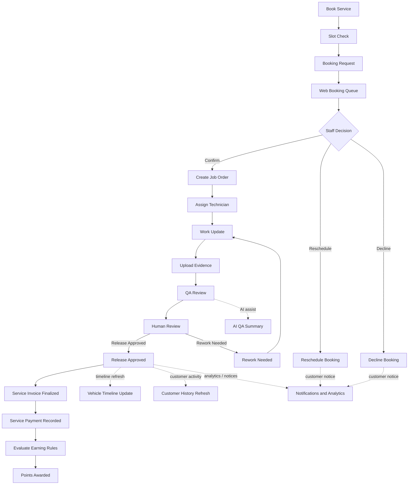

# Main Service Operations Flow

```mermaid
flowchart TD
  Book[Book Service] --> Slot[Slot Check]
  Slot --> Request[Booking Request]
  Request --> Queue[Web Booking Queue]
  Queue --> Decision{Staff Decision}
  Decision -->|Confirm| Job[Create Job Order]
  Decision -->|Reschedule| Reschedule[Reschedule Booking]
  Decision -->|Decline| Decline[Decline Booking]

  Job --> Assign[Assign Technician]
  Assign --> Work[Work Update]
  Work --> Evidence[Upload Evidence]
  Evidence --> QA[QA Review]
  QA --> Human[Human Review]
  QA -. AI assist .-> AI[AI QA Summary]
  Human -->|Release Approved| Release[Release Approved]
  Human -->|Rework Needed| Rework[Rework Needed]
  Rework --> Work

  Release --> Invoice[Service Invoice Finalized]
  Invoice --> Payment[Service Payment Recorded]
  Payment --> Rewards[Evaluate Earning Rules]
  Rewards --> Points[Points Awarded]

  Release -. timeline refresh .-> Timeline[Vehicle Timeline Update]
  Release -. customer activity .-> History[Customer History Refresh]
  Release -. analytics / notices .-> Support[Notifications and Analytics]
  Reschedule -. customer notice .-> Support
  Decline -. customer notice .-> Support
```
