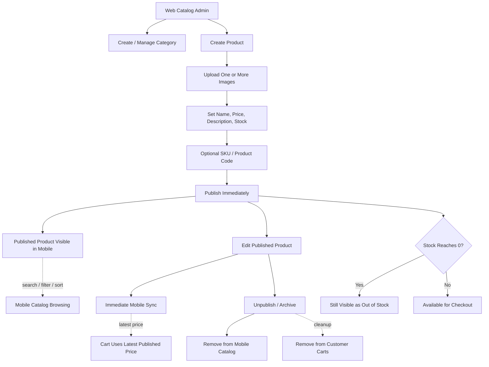

# Shop Product Admin Flow

```mermaid
flowchart TD
  Admin[Web Catalog Admin] --> Category[Create / Manage Category]
  Admin --> Product[Create Product]
  Product --> Images[Upload One or More Images]
  Images --> Details[Set Name, Price, Description, Stock]
  Details --> Optional[Optional SKU / Product Code]
  Optional --> Publish[Publish Immediately]

  Publish --> Visible[Published Product Visible in Mobile]
  Publish --> Edit[Edit Published Product]
  Edit --> Sync[Immediate Mobile Sync]
  Publish --> StockZero{Stock Reaches 0?}
  StockZero -->|Yes| Out[Still Visible as Out of Stock]
  StockZero -->|No| Available[Available for Checkout]

  Edit --> Archive[Unpublish / Archive]
  Archive --> Remove[Remove from Mobile Catalog]
  Archive -. cleanup .-> Cart[Remove from Customer Carts]

  Visible -. search / filter / sort .-> Browse[Mobile Catalog Browsing]
  Sync -. latest price .-> Pricing[Cart Uses Latest Published Price]
```
